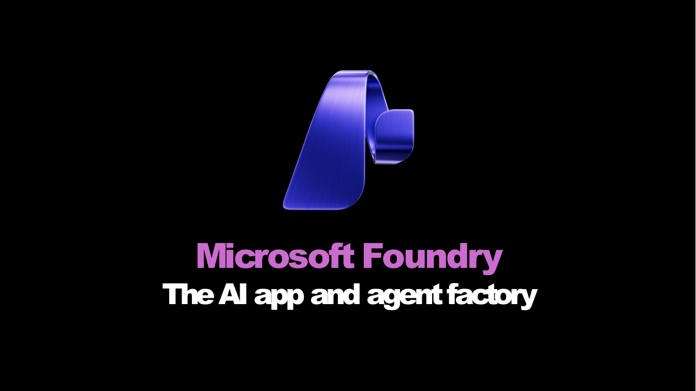
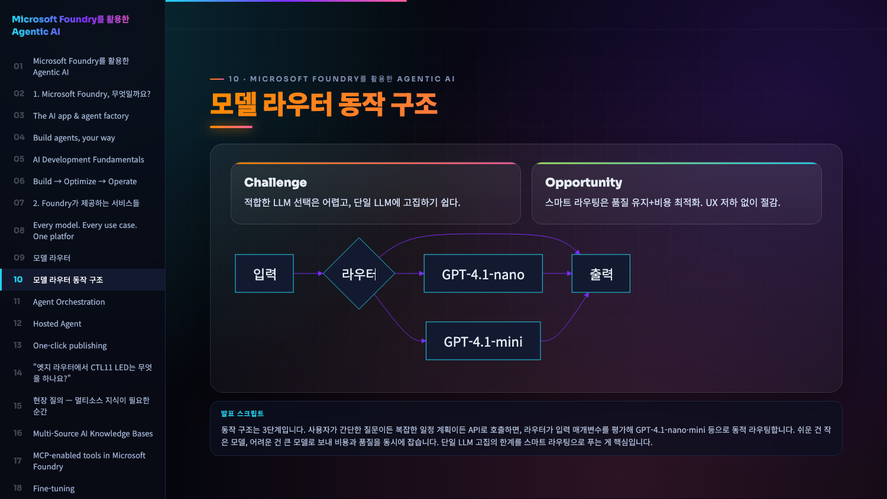
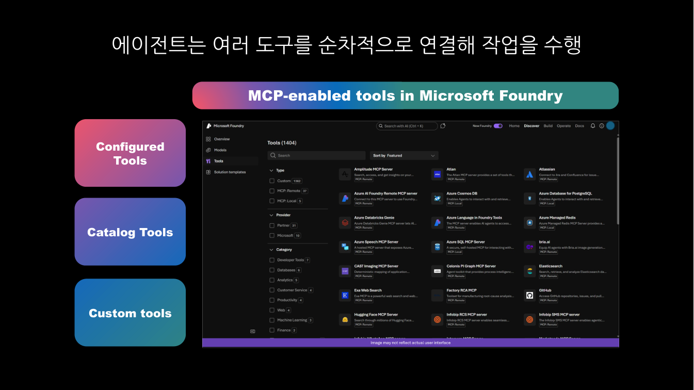
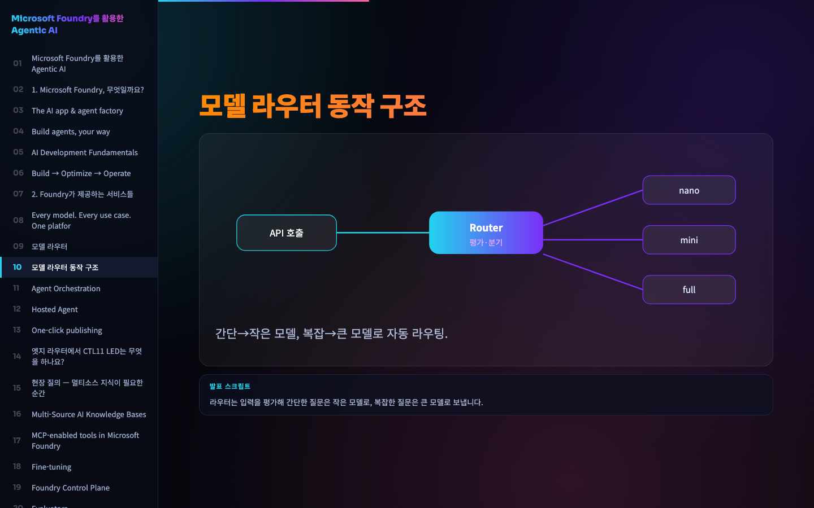

# 발표가 끝나도 늙지 않는 PPT — 말 한마디로 갱신되는 라이브 웹 데모를 만드는 Copilot Skill

> 하네스톤 2026 · **트랙2** · 제출물: **Copilot Skill** (`skills/pptx-to-web/`)

**기술은 매주 바뀝니다. 그런데 PPT는 만든 순간 그대로 멈춰 있습니다.** 새 기능·새 수치가 나올 때마다 파일을 열고, 고치고, 다시 export하고, 메일에 첨부하고, 버전이 엉킵니다. 빠른 변화에 발표자료가 따라가질 못합니다.
**자료를 웹(HTML)으로 관리하면 다릅니다.** 한 곳만 고치면 모두가 같은 최신본을 봅니다. `pptx-to-web`은 PPTX를 웹으로 바꿔, GitHub Copilot에게 **"이 부분 최신으로 바꿔줘" 한마디**면 갱신·재배포되고, 고객에겐 **URL 하나**로 끝. 변화가 빠를수록, 멈춘 파일보다 살아있는 웹이 효율적입니다.

🔗 **이 스킬이 자동 생성한 결과:** https://hijigoo.github.io/tech-summit-hanessathon-2026/

## 한눈에 보이는 효과: Before → After
정적인 PPT 한 장이 **목차·다이어그램·실제 UI·발표 스크립트까지 갖춘 웹 슬라이드**로 재해석됩니다. (스킬 호출 한 번, 사람 손 0)

**텍스트 카드 → Mermaid 다이어그램**
| Before — PPTX 원본 | After — 자동 생성 웹 (Mermaid) |
|:--:|:--:|
|  |  |
| 단순 박스 4개·하단 캡션 | 라우터 분기·병합 흐름도 + Challenge/Opportunity 카드 + 발표 스크립트 |

**평면 스크린샷 → 실제 제품 UI 임베드**
| Before — PPTX 원본 | After — 자동 생성 웹 (실 UI) |
|:--:|:--:|
|  |  |
| 캡처 한 장 붙여넣기 | 좌측 목차 + 요점 카드 + 원본 UI 그대로 임베드(1,404 도구) |

## 왜 효과적인가
| 기존 방식 (PPTX) | pptx-to-web |
|---|---|
| 수정할 때마다 파일 열고 재export·재첨부 | **Copilot에 한마디 → 사이트 자동 갱신·재배포** |
| 메일 첨부·버전 충돌·"최신본 어디?" | **URL 하나** — 누구나 같은 최신본 |
| 발표 후 내용이 곧 구식 | **Azure/Foundry "What's new" 자동 반영** |
| 디자인·빈 장표 수작업 | **AI 재해석 다이어그램 · 빈 슬라이드 0 자동 검증** |

## 동작 방식 (스킬 하나로 6단계)
1. **캡처** — PPTX 전체를 PNG로
2. **재해석** — 에이전트가 PNG를 보고 발표자 노트 → 박스·도넛·허브·Mermaid 플로우 다이어그램으로 작성
3. **최신화** — Azure 공식 "What's new" 자동 추가
4. **빌드** — 목차·1화면 랜드스케이프·6색 테마·발표 노트 덱 생성
5. **검증** — 빈 장표 0 자동 확인
6. **배포** — GitHub Pages → 고객에게 URL만 공유

## 스킬 구성
| 파일 | 역할 |
|---|---|
| `SKILL.md` | 워크플로우·규칙·컴포넌트 사양 (에이전트가 따르는 단일 명세) |
| `scripts/capture.py` | 모든 장표를 PNG로 캡처 |
| `scripts/pptx2web_native.py` | content.json → 컬러풀 랜드스케이프 HTML 덱 빌드 |
| `scripts/fetch_updates.py` | Azure/Foundry 최신 업데이트 자동 수집·추가 |
| `scripts/verify.js` | headless 렌더로 빈 슬라이드 0 검증 |
| `templates/` | 컴포넌트 예시 + 완성 덱 레퍼런스 |

## 사용 — Copilot에 스킬 적용
파일을 직접 돌리는 게 아니라, 이 스킬을 Copilot에 얹고 **자연어로 시키면** 됩니다.

1. **스킬 설치** — `skills/pptx-to-web/` 폴더를 Copilot 스킬 경로에 둡니다.
   - 프로젝트: 레포의 `.github/skills/`
   - 사용자 전역: `~/.copilot/skills/`
   ```bash
   cp -r skills/pptx-to-web ~/.copilot/skills/
   ```
2. **한마디로 호출** — 이후 Copilot에 그냥 말하면 스킬이 자동 발동합니다.
   > "이 pptx 웹으로 바꿔서 Pages에 올려줘"
   > "발표자료 최신 Foundry 업데이트 반영해서 다시 배포해줘"
   > "9번 장표를 다이어그램으로 다시 그려줘"
3. Copilot이 캡처 → 재해석 → 빌드 → 검증 → 배포까지 알아서 수행합니다. 내용 갱신도 **요청 한마디**면 끝.

> 트리거 키워드: "pptx to web", "파워포인트 웹으로", "장표 재해석", "발표자료 웹버전", "최신 업데이트 반영", "pages에 배포".

**활용 대상:** 최신 정보를 자주 반영해 고객에게 발표·공유해야 하는 SE·세일즈·교육자.
